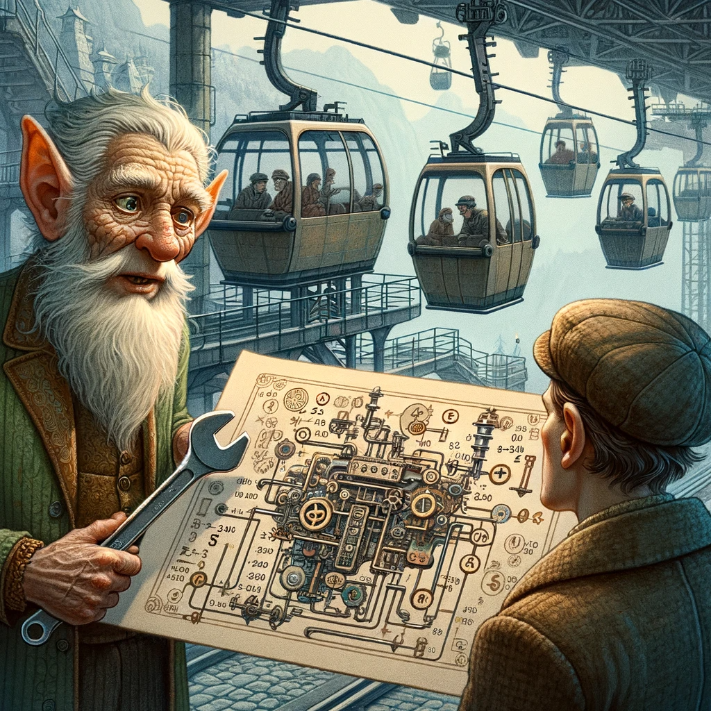

# Advent of Code 2023 :christmas_tree: :gift:

<b>Hello! :wave: I'm having fun with [AoC](https://adventofcode.com/) using Python3.12 on MacOS.  :computer: </b>

Using VS Code with "GitHub Copilot Chat" to help write some of the code. As per the rules, I don't intend to attempt to earn points but to simiply have fun while experimenting with Generative AI. :smile: I've added my prompts to the top of each day's code when I remembered to save them.

To run my code...

```bash
$ python3 -m venv venv
$ source venv/bin/activate
$ pip install -r requirements.txt
$ python ./Day1/day1_part1.py
```

<table>

<tr> <!-- New Row -->

<td>

### [Day 1: Trebuchet?!](./Day1/overview.md)

[Part One ](./Day1/part1.py) :star: - [Part Two](./Day1/part2.py) :star:


</td>

<td>

### [Day 2: Cube Conundrum](./Day2/overview.md)

[Part One](./Day2/part1.py) :star: - [Part Two](./Day2/part2.py) :star:


</td>

<td>

### [Day 3: Gear Ratios](./Day3/overview.md)

[Part One](./Day3/part1.py) - [Part Two](./Day3/part2.py)



</td>

</tr> <!-- End Row -->

</table>